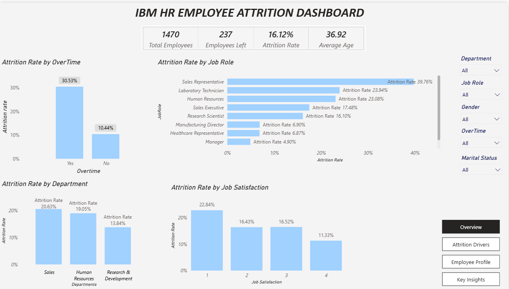
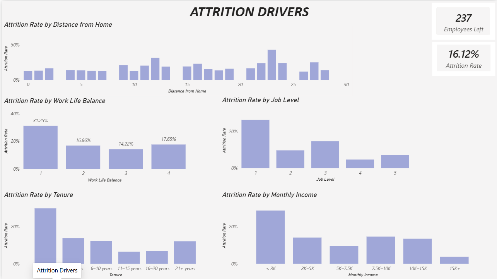
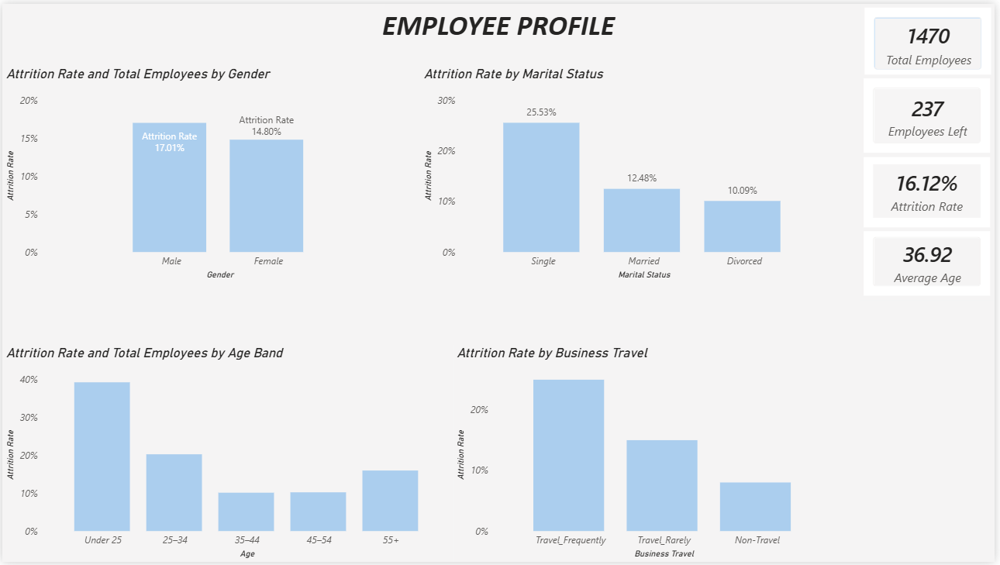
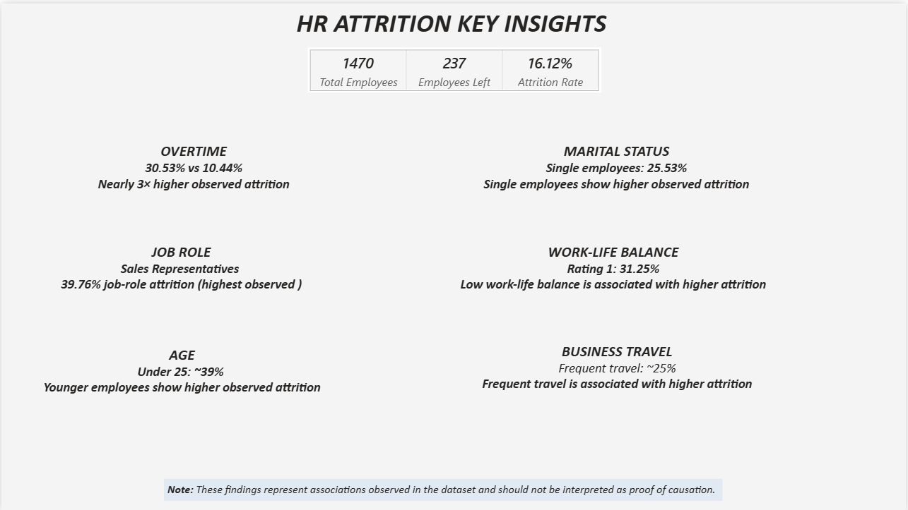

# IBM HR Employee Attrition Analytics Dashboard

## Project Overview
This project presents an interactive **HR Employee Attrition Analytics Dashboard** built using **Microsoft Power BI**. The dashboard analyzes employee attrition patterns across demographic, employment, compensation, workplace, and job-related factors using the IBM HR Employee Attrition dataset.
The goal of the project is to transform raw HR data into an interactive analytical report that can help identify employee groups and workplace characteristics associated with higher observed attrition.
---
## Business Problem
Employee attrition can create significant challenges for organizations, including:
- Increased recruitment and hiring costs
- Loss of experienced employees
- Reduced workforce stability
- Knowledge and productivity loss
- Increased workload for remaining employees

This dashboard explores:
> **Which employee characteristics and workplace factors are associated with higher employee attrition?**
The analysis focuses on identifying patterns rather than establishing causal relationships.

# Dashboard Preview## Overview

The Overview page provides a high-level summary of employee attrition and allows users to explore the data using interactive filters.
### Key Metrics
| Metric | Value |
|---|---:|
| Total Employees | **1,470** |
| Employees Left | **237** |
| Attrition Rate | **16.12%** |
| Average Age | **36.92 years** |
| Average Years at Company | **7.01 years** |

The page includes analysis of:
- Attrition by Overtime
- Attrition by Job Role
- Attrition by Job Satisfaction
- Attrition by Department

Interactive slicers allow the report to be filtered by:
- Department
- Job Role
- Gender
- Overtime
- Marital Status

## Attrition Drivers

This page focuses on workplace and employment characteristics associated with employee attrition.
The analysis includes:
- Distance from Home
- Job Level
- Work-Life Balance
- Years at Company
- Monthly Income

Custom analytical bands were created for:
### Tenure
- 0–2 years
- 3–5 years
- 6–10 years
- 11–15 years
- 16–20 years
- 21+ years

### Monthly Income
- < 3K
- 3K–5K
- 5K–7.5K
- 7.5K–10K
- 10K–15K
- 15K+

These groupings make the analysis easier to interpret than using individual values or overly granular automatic bins.

## Employee Profile

This page examines attrition patterns across employee demographic characteristics.
The analysis includes:
- Gender
- Marital Status
- Age Band
- Business Travel

Age was grouped into:
- Under 25
- 25–34
- 35–44
- 45–54
- 55+

## Key Insights

The final page summarizes the most important patterns identified during the analysis.
### Overtime
Employees working overtime have an observed attrition rate of **30.53%** compared with **10.44%** among employees who do not work overtime.
This represents nearly **3× higher observed attrition** among employees working overtime.

### Job Role
Sales Representatives have the highest observed attrition rate among the job roles analyzed at **39.76%**

### Age
Employees under 25 show substantially higher observed attrition than the older age groups, with an observed attrition rate of approximately **39%**

### Marital Status
Single employees show an observed attrition rate of **25.53%** compared with **12.48%** for married employees.

### Work-Life Balance
Employees with the lowest work-life-balance rating show an observed attrition rate of **31.25%**

### Business Travel
Employees who travel frequently show substantially higher observed attrition than employees who travel rarely or do not travel.

# Tools & Technologies

### Power BI
Used for:
- Dashboard development
- Data modeling
- Interactive visualizations
- Slicers and filtering
- Page navigation
- Report design

### DAX
Used to create:
- Total Employees
- Employees Left
- Attrition Rate
- Average Age
- Average Years at Company
- Custom analytical bands
- Sorting columns

### Power Query
Used for data preparation and transformation before analysis.

## DAX Measures & Calculated Columns

The Power BI dashboard uses DAX measures for the core HR metrics and calculated columns for analytical grouping and sorting.

### Core Measures

#### Total Employees

    Total Employees =
    COUNTROWS('HR Analytics')

#### Employees Left

    Employees Left =
    CALCULATE(
        COUNTROWS('HR Analytics'),
        'HR Analytics'[Attrition] = "Yes"
    )

#### Employees Stayed

    Employees Stayed =
    CALCULATE(
        COUNTROWS('HR Analytics'),
        'HR Analytics'[Attrition] = "No"
    )

#### Attrition Rate

    Attrition Rate =
    DIVIDE(
        [Employees Left],
        [Total Employees],
        0
    )

> Format as Percentage with 2 decimal places.

#### Average Age

    Average Age =
    AVERAGE('HR Analytics'[Age])

#### Average Monthly Income

    Average Monthly Income =
    AVERAGE('HR Analytics'[MonthlyIncome])

#### Average Years at Company

    Average Years at Company =
    AVERAGE('HR Analytics'[YearsAtCompany])

---

### Calculated Columns

#### Tenure Band

    Tenure Band =
    SWITCH(
        TRUE(),
        'HR Analytics'[YearsAtCompany] <= 2, "0–2 years",
        'HR Analytics'[YearsAtCompany] <= 5, "3–5 years",
        'HR Analytics'[YearsAtCompany] <= 10, "6–10 years",
        'HR Analytics'[YearsAtCompany] <= 15, "11–15 years",
        'HR Analytics'[YearsAtCompany] <= 20, "16–20 years",
        "21+ years"
    )

#### Tenure Band Sort

    Tenure Band Sort =
    SWITCH(
        TRUE(),
        'HR Analytics'[YearsAtCompany] <= 2, 1,
        'HR Analytics'[YearsAtCompany] <= 5, 2,
        'HR Analytics'[YearsAtCompany] <= 10, 3,
        'HR Analytics'[YearsAtCompany] <= 15, 4,
        'HR Analytics'[YearsAtCompany] <= 20, 5,
        6
    )

`Tenure Band` is sorted using `Tenure Band Sort`.

---

#### Income Band

    Income Band =
    SWITCH(
        TRUE(),
        'HR Analytics'[MonthlyIncome] < 3000, "< 3K",
        'HR Analytics'[MonthlyIncome] < 5000, "3K–5K",
        'HR Analytics'[MonthlyIncome] < 7500, "5K–7.5K",
        'HR Analytics'[MonthlyIncome] < 10000, "7.5K–10K",
        'HR Analytics'[MonthlyIncome] < 15000, "10K–15K",
        "15K+"
    )

#### Income Band Sort

    Income Band Sort =
    SWITCH(
        TRUE(),
        'HR Analytics'[MonthlyIncome] < 3000, 1,
        'HR Analytics'[MonthlyIncome] < 5000, 2,
        'HR Analytics'[MonthlyIncome] < 7500, 3,
        'HR Analytics'[MonthlyIncome] < 10000, 4,
        'HR Analytics'[MonthlyIncome] < 15000, 5,
        6
    )

`Income Band` is sorted using `Income Band Sort`.

---

#### Age Band

    Age Band =
    SWITCH(
        TRUE(),
        'HR Analytics'[Age] < 25, "Under 25",
        'HR Analytics'[Age] < 35, "25–34",
        'HR Analytics'[Age] < 45, "35–44",
        'HR Analytics'[Age] < 55, "45–54",
        "55+"
    )

#### Age Band Sort

    Age Band Sort =
    SWITCH(
        TRUE(),
        'HR Analytics'[Age] < 25, 1,
        'HR Analytics'[Age] < 35, 2,
        'HR Analytics'[Age] < 45, 3,
        'HR Analytics'[Age] < 55, 4,
        5
    )

`Age Band` is sorted using `Age Band Sort`.

---

### DAX Summary

| Type | Calculation |
|---|---|
| Measure | Total Employees |
| Measure | Employees Left |
| Measure | Employees Stayed |
| Measure | Attrition Rate |
| Measure | Average Age |
| Measure | Average Monthly Income |
| Measure | Average Years at Company |
| Calculated Column | Tenure Band |
| Calculated Column | Tenure Band Sort |
| Calculated Column | Income Band |
| Calculated Column | Income Band Sort |
| Calculated Column | Age Band |
| Calculated Column | Age Band Sort |
